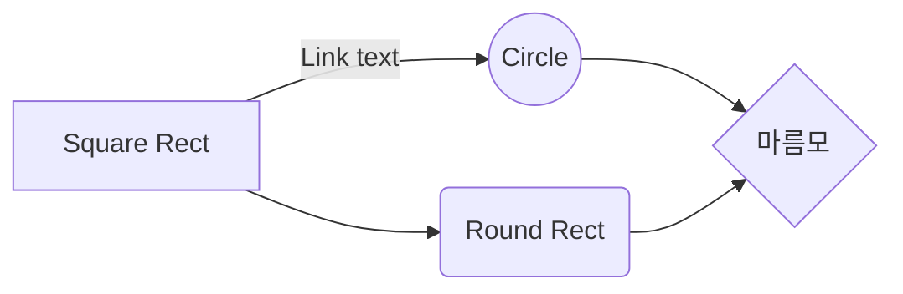

## 예상 질문
- 1분 자기소개
  : 안녕하세요 클린코드를 지향하는 지원자 떙떙떙입니다.    
    학부시절 7개의 프로젝트 경험이 있습니다. 프로젝트를 통해 CS를 학습하였다고 생각합니다. 그때 작성한 코드는 스파게티 코드였다고 생각이 됩니다. 왜냐하면 코드의 가독성이 없었기 때문입니다. 하지만 지금은 리팩터링에 관심 많고 이해하기 쉬운코드, 효율적인 코드 작성을 노력중입니다.    
    이런 노력을 통해 앞으로는 백엔드 개발자로 전문성을 키우고 싶습니다.    
    전문성을 키우고자 spring,docker,git,DB 등을 학습하고 블로그에 기록하고 있습니다.   
    싸피를 통해 효율적인 코드, 협업, 전문성을 키우고 싶은 0년차 백엔드 주니어입니다.

- 가장 자신있어 하는 것은 무엇인가요?
  : 

- 관심 있는 IT 동향은 무엇인가요?
  : 

- 본인의 장점과 단점
  : 쉽게 포기 하지 않는 장점이 있다고 생각합니다. 프로젝트를 진행하면 항상 밤을 새는 경우가 많았습니다. 하고싶은게 많은데 잘 안 되었기 때문에 밤새 몰두하는 경우가 많았습니다. 사소한 기능이라도 끝끝내 구현에 이르면 개발에 재미를 느끼곤 했습니다. 이런 경험의해서 저는 끈기가 있다고 생각합니다.   
  : 단점은 하나에 깊게 파고들다 보면 주변을 보지 못하는 단점이 있습니다. 밤새도록 코드작성 및 레퍼런스 검색을 하다보면 다른것에 집중하지 못 할때가 많았습니다. 

- 지원동기
  : 문제해결을 위한 알고리즘 , 진정한 협업을 경험하고자 지원하게 되었습니다.    
  저는 학부시절 7개의 프로젝트를 진행하였는데 그중 5개를 같은 팀원과 진행하였습니다. sns로 버전관리, 주먹구구식 소통 등의 협업을 경험하였습니다. 그당시의 협업은 현재 제가 하고싶은 협업은 아니였다 라는 생각이 듭니다.    
  저는 싸피에서 코드리뷰, git flow,pull request, CICD, 등 다양한 방법을 통해서 제대로 된 협업을 경험하고 싶습니다.    
  이런 과정 중에 효율적 알고리즘에 의한 더빠른 , 더 이해하기 쉬운 코드를 작성방법을 배우고 싶습니다.    
  알고리즘과 협업을 학습하고 경험하고 싶어 지원하게 되었습니다.   

- 마지막으로 하고싶은말
  : 사피 설명회 통해서 코드리뷰가 진행됨을 알고있습니다. 이외에도 싸피 동기간 개발서적 스터디, 짝프로래밍등 다양한 IT문화를 경험할 수 있는 시스템이 있는지 궁금합니다. 

- 어려움을 해결한 경험
  : 

- 동료와의 갈등 , 해결 경험
  : c로 keyvalueStore 구현해야했습니다. 4학년과 팀이 되었고 제가 너무 프로그래밍 능력이 부족하다고 핀잔을 주었습니다. 맞는말이지만 기분은 좋지 않았습니다. 
  그렇다고 여기서 제가 아무것도 안할수는 없기에 오히려 더 열심히 자료구조를 공부하고 i/o는 어떻게 받을지 준비를 많이 해갔습니다. 
  팀원이 저의 정성을 보았나 제가 부족한 부분을 많이 알려주었고 둘 사이의 갈등 또한 사라졌습니다. 
  플젝이 끝난뒤에 저는 내가 이런상황에서 팀원처럼 해야겠다는 다짐을 하였습니다. 정말 거의 모든걸 알려주었는데 저또한 열심히 배우려고 하였습니다. 
  비트리와 해쉬를 사용하여 키밸류스토어를 구현할수있었고 좋은 프로젝트 결과를 얻을수있었습니다.

- 전공자인 내가 싸피를 교육이수의 메리트는 ? (나는 협업, 알고리즘)
  : 저는 알고리즘, 협업능력이 부족하다고 생각됩니다. 또한 이것들은 제가 잘하고 싶은 영역입니다.   
  싸피를 통해 알고리즘,협업능력을 키울수있다고 알려져있습니다. 물론 혼자서도 할수있지만 싸피에서의 피드백을 받고 싶습니다. 멘토의 피드백, 동기의 피드백 이러한 IT문화를 경험하고 싶습니다. 또한 제가 아는것은 다 알려주고 싶습니다. 
  이런 과정을 통해서 제가 성장 할 수 있다고 생각하기 떄문에 전공자인 제가 싸피를 이수하고 싶은 이유입니다. 

  : 저는 학부시절 협업의 기회를 날렸습니다. sns를 통한 주먹구구식의 개발을 진행 하였습니다. 
  저는 싸피를 통해서 협업의 기회, 동료를 얻고 싶습니다. 
  피드백을 주고 받는 동료!! 이러한 IT문화를 경험함으로서 저의 개발ㅁ역량을 늘리고 싶습니다. 
  이러한 이유로 싸피는 전공자인 제가 놓쳤던 기회를 다시 잡는 시간이라고 생각하며 싸피 지원한 이유입니다. 

- 취업해서 배우는게 더 나은거 아니야 ?
  협업을 경험하고 싶습니다. 커뮤니트를 통해서도 구하였지만, 결속력이 많이 부족하였습니다. 그래서 싸피를 통해 동료를 얻고 싶습니다.   
  알고리즘,협업의 중요성이 강조되고 있습니다. 저는 이러한 부분이 약하고 더욱 학습하고 싶습니다. 그렇기에 싸피를 통해서 더 배우고 싶습니다. 실무수준의 협업을 배우고 싶습니다. 

- 자신만의 경쟁력
  : 도전의식이 저의 경쟁력이라고 생각합니다. 안될걸 아는데 도전합니다. 한번에 안되겠지만 여러번 도전하다보면 언젠간 될거라는 믿음이 있습니다. 이러한 마인가 저의 경쟁력이라고 생각합니다. 
  이는 꾸준함이 될수도 있겠고, 논리적인 사고능력이 될수도 있으리라 생각합니다. 

- 인상깊게 들은 과목
  : 운영체제가 인상 깊었습니다. 컴퓨터가 동작하는 과정을 학습하기 때문이고 cli를 직접적으로 사용하기 때문에 당시에 인상깊었습니다. 
  현재 인상깊은 과목을 선택하여도 역시 운영체제입니다. 운영체제에서 학습한 스케줄링, 운영체제 구성 내용등이 결국 응용소프트웨어에서도 사용되기 때문입니다. 


- 좋아하는 일과 잘하는 일중 선택해야한다면 무엇을? 
  : 잘하는일 선택해야합니다. 회사의 이익이든 본인의 이익이든 일을 통해 생산적인 결과물을 나타내야 하기 때문입니다. 좋아하는 일이라는 것은 저의 이익으로 대변되는 부분이고 이것은 개인시간을 이용해서 활용해야 한다고 생각합니다. 

- 대인관계에 관한 질문
  : 저의 좋은게 좋은거다 라는 마인드로 대인관계를 유지합니다. 그리고 경청의 중요성을 알고있습니다. 하지만 프로젝트등의 목적이 분명한 경우 명확한 요구를 요하는 스타일 입니다.   
  질문을 할때에 상대의 시간을 위해 스스로 최대한 알아보고 이러한 시도를 했다고 알린 뒤 질문을 하곤 합니다. 
  대인관계가 나빠지면 이는 상대와 본인 둘 다 문제가 존재한다고 생각합니다. 본인의 잘못을 인지하는 과정이 필요하며 이를 상대방과 공유할수 있어야 할 것으로 생각합니다. 

- 창의력을 발휘한 경험은 ?
  
- 지원자는 리더형인가 팔로워형인가?

  


- 어떠한 개발자가 되고 싶나요
- 자소서 기반으로 어떻게 진행되었는지 
- 알고리즘 


피티 면접   
AI, 빅데이터(4차산업혁명) 를 적용해서 어떻게 응용을 할수있겠는가? 


같은 프로세스 다른 디비
상품목록을 레디스와같은 저장소에 캐싱하고  쿼리 모델을 레디스를 사용하는 방식이죠
명령이 데이터를 변경하면 변경내역을 쿼리쪽 디비에 전달하게 됩니다. 

다른 다른
명령이 데이터에 변경하면 이 내역을 쿼리쪽에 전달해야합니다. 
MSA에서 사용하는 방식입니다. 

전달방법
1 명령이 직접 쿼리디비를 수정하는 방식이에요.
  카프카 같은 메시징을 이용해서 전달하는 방법도 있습니다. 
  이방법은 데이터 유실 가능성이 존재합니다. 
  문제가 발생하게되면 쿼리디비에 반영해야할 데이터가 유실될수있다.
  쿼리디비나 메세징의 문제때문에 명령을 수행하는것 자체가 에러가 날수있다. 

2 두번째는 명령디비에 기록하고 별도의 전파기를 통해서 쿼리디비에 전달하는 방식이에요
  일단 명령을 상태를 변경한 다음에 뭘 바꿨는지 별도의 테이블에 기록을 합니다. 이과정은 한 트랜잭션으로 처리되기 떄문에 데이터가 유실되지 않는 장점이 있다. 
  이때 전파기를 따로 구현해야하는 단점이 존재하다.

3 디비가 제공하는 CDC를 사용하는 방법입니다. 
  예를 들면 디비의 바이너리 로그를 읽어서 변경데이터를 확인하고 이를 쿼리쪽에 전달하는 방식이다. 
  명령쪽 코드에서 변경내역을 따로 저장하지 않아도 되니깐 명령코드가 단순해지는 장점이 존재합니다. 

주의할점
  데이터 유실 : 유실 허용여부에 따라 DB트랜잭션 범위가 중요
  허용가능 지연 시간 : 명령의 반영내역을 얼마나 빨리 반영해야하는가 등의 허용가능한 지연시간이 존재하고 이를 고려해야한다.
  중복전달 : 유실을 고려해서 다시전달 할 수 있는 방법을 만들게 되면 쿼리쪽에 이미 반영된 데이터를 중복으로 전달한 경우도 발생하게 될것이다. 이때 쿼리쪽 데이터가 망가지지 않도록 별도의 처리를 해야합니다. 
  
  이외에도 다른 주의사항도 존재합니다. 


정리 cqrs는 명령 역할을 수행하는 구성요소와 쿼리 역할을 수행하는 구성요소를 나누는것을 cqrs라고 함
왜하냐?
     1 명령과 쿼리는 다루는 데이터가 다름 
     2 명령과 쿼리는 코드 변경 빈도/사용자가 다름
     3 기능 마다 성능 요구가 다름


## 카프카 (분산 이벤트 스트리밍 플랫폼 - 하이포퍼먼스)

1. 기본구조 
  - 카프카 클러스터 : 메시지를 저장하는 저장소이다. 하나의 카프카 클러스터는 여러개의 브로커로 구성된다. 
    - 브로커는 각각의 서버라고 생각하면 된다. 
    - 브로커들이 메세지를 나눠서 처리하고 이중화도 하고, 장애 대체의 역할을 수행한다.
  - 주키퍼클러스터 (앙상블) : 카프카 클러스터를 관리한다. 주키퍼속에 카프카 클러스터의 정보과 관리된다. 
  - 프로듀서 : 카프카에 메세지를 넣는 역할을 한다. 
  - 컨슈머 : 메시지를 카프카에서 읽음

2. 토픽과 파티션
  - 토픽 : 메시지를 구반하는 단위 ex) 뉴스용 토픽, 메일토픽 ... 즉 파일시스템의 폴더와 유사
  - 한 개의 토픽은 한개 이상의 파티션으로 구성
    - 파티션은 메시지를 저장하는 물리적인 파일
  
  - 파티션 : 추가만 가능한 파일(append-only)
    - 각 메시지 저장 위치를 오프셋 이라고 함
    - 프로듀서가 넣은 메시지는 파티션의 맨 뒤에 추가
    - 컨슈머는 오프셋 기준으로 메시지를 순서대로 읽음
    - 메시지는 삭제되지 않음(설정에 따라 일정 시간이 지난뒤 삭제)

  - 여러 파티션과 프로듀서
   - 프로듀서는 라운드로빈 또는 키로 파티션 선택
   - 같은키를 갖는 메시지는 같은 파티션에 저장 -> 같은 키는 순서 유지

  - 여러 파티션과 컨슈머
    - 컨슈머는 컨슈머그룹에 속함
    - 한개 파티션은 컨슈머그룹의 한 개 컨슈머만 연결가능
      - 즉 컨슈머그훕에 속한 컨슈머들은 한 파티션을 공유할 수 없음
      - 한 컨슈머그룹 기준으로 파티션의 메시지는 순서대로 처리

3. 성능
  - 파티션 파일은 os 페이지 캐시 사용
    - 파티션에 대한 파일 IO를 메모리에서 처리
    - 서버에서 페이지캐시를 카프카만 사용해야 성능에 유리
  - Zero Copy
    - 디스크 버퍼에서 네트워크 버퍼로 직접 데이터 복사
  - 컨슈머 추적을 위해 브로커가 하는 일이 비교적 단순
    - 메시지 필터, 메시지 재전송과 같은 일은 브로커가 하지 않음
      - 프로듀서,컨슈머가 직접 해야 함
    - 브로커는 컨슈머와 파티션 간 매핑 관리

  - 묶어서 보내기, 묶어서 받기 (batch)
    - 프로듀서 : 일정 크기만큼 메시지를 모아서 전송가능
    - 컨슈머: 최소 크기만큼 메시지를 모아서 조회 가능
  - 낱개 처리보다 처리량 증가 
  - 처리량 증대(확장)가 쉬움
    - 1개 장비의 용량 한계 -> 브로커 추카, 파티션 추카
    - 컨슈머가 느림 ->컨슈머 추가(+파티션 추가)

  - 리플리카 : 파티션의 복제본
    - 복제수(replication factor) 만큼 파티션의 복제본이 각 브로커에 생김
  - 리더와 팔로워 구성
    - 프로듀서와 컨슈머는 리더를 통해서만 메시지 처리
    - 팔로워는 리더로부터 복제
  - 장애 대응 
    - 리더가 속한 브로커 장애시 다른 팔로워가 리더가 됨

4. 프로듀서 
  - 

  


## 프로그래밍 초식 
1. 변수아끼끼 : 의미를 더해주는 변수 위주로 사용하기 (식이 복잡하거나 길어지 ㄹ경우 변수 이름으로 설명)
  - 가능한 선언과 값 할당을 한번에 하자 
  - 최대한(절대로) 변수의 용도/의미 변경 X : 의미나 용도가 다르면 다른 변수 사용할것 (이러면 개발자들이 코드를 이해가 어려워진다. )
  - 변수가 사용되는 코드 범위를 최소화하기 ex) forloop만을 위한 코드를 작성하라 
    ```
        for(Some some : somes){
            String msg = some.getName() + ~~
        }

        =====================

        .... (코드 10줄)
        String msg = ...;
        return Result.message(msg);
    ```
  - 변수를 아끼는 연습하기 
  - 중요한 코드의 복잡도를 낮추고 가독성을 높이는 쉬우 방법 -> 변수 아끼고 변경 줄이고 범위 좁히고 

2. 나누기 
  - 구현기술을 여러 기본기 하나이다. 
  - 초짜 특징 중 하나 : 점점 커지는 함수/메서드/클래스
  - 너무 커지면 프로그램 분석이 어려워짐(수정이 어려워짐)
     - 흔한 예: 
       - if-else, if 중첩이 복잡해짐
       - 변수의 의미가 중간에 바뀜
       - 코드 안에서 중복이 발생함
  - 의미가 있는 단위로 코드/구성 요소를 나누는 기술 : 나누기
  - 패턴은 전형적인 예
    - 웹개발 : 컨트롤러 - 서비스 - DAO
    - DDD : 엔티티, 밸류, 리포지토리
    - 디자인 패턴: 빌더, 어댑터, 컴포지트 등
  - 나누기는 곧 기능 분해/분리 : 기능은 여러 작은 기능/로직(하위 기능)으로 구성
  - 나눈 하위 기능을 메서드나 클래스로 분리 : 나누기의 결과
    ```
    OrderRepository : DB에서 주문 데이터 읽기, DB에서 변경데이터 쓰기
    Order : 주문 취소 가능여부 확인, 주문데이터 변경
    OrderCancelService : 취소 처리 흐름제어 
    Notifier : 취소 결과 통지 
    PayCancelService : 결제 취소
    ```
  - 나누기는 역할/책임 도출 인것이다. 
  - 어떤 기준으로 나누나? : 정답은 없음 하지만 보통은 기능에서 의미가 있는 하위 기능 단위로 나누는 시도를 추천
    - 주문취소 기능 : 취소의 입장에서 의미있는 단위 
      - 취소 사싱 통지 vs push 테이블에 insert
      - 결제 승인 취소 vs pg사가 제공하는 API 실행
    - 대칭성 활용의 측면
      - 취소는 취소끼리 비슷한 기능끼리 나눈다. (코드간의 수준을 맞춘다.)
  - 나눈결과 
    - 나누기를 안하면 
      - 코드 순서대로 구현을 이해하는 것이 가능
      - 근데 코드가 커질수록 코드가 복잡해져서 점점 이해하기 어려워짐
      - 코드가 커질수록 변경도 어려워짐
    - 나누기를 잘하면 
      - 구조의 복잡도가 증가하지만 상위 수준에서 실행 흐름 이해하기 좋음
      - 코드 변경이 (나누기 전보다 ) 쉬워질 가능성이 높아짐 
    - 너무 잘게 나누면
      - 너무 복잡해져서 실행 흐름을 이해하기 어려워짐
      - 변경할 떄 수정 대상이 많아져 변경이 어려워짐

3. WHAT,HOW
  - 하려는것/의미/의도(WHAT) - 그것의 실제 구현(HOW)

    |what|how|
    |------|---|
    |가입한지 1년 미만|user 테이블에서 reg칼럼 값 기준으로 count|
    | 추가 지급 내역 남김|log 테이블에 insert|
    
    `의미가 들어나게 생각해보고 이를 코드로 만드는 연습을 해라 !`

    ```
    int addPointRate = 0;
    if(userRegistedLessThanOneYear(userId)){
        addPointRate = 1;
    }
    ...
    if(addPointRate > 0){
        recordAddPointHistory(userId,addPointRate);
    }
    ```
    
  - what 최대한 드러나게 생각을 하자(슈도코드 등등) -> 그리고 실제로 코드상에서 어떻게 이를 적용할지 생각한다(의도가 드러나게 !)

  - WHAT,HOW 분리 결과
    - 구현을 잠시 잊고 실제 하려는 것이 무엇인지 생각하게 됨
      - 실제 하려는 것이 코드에 표현될 가능성이 높아짐
      - 코드의 가독성이 향상
      - 유지보수성이 좋아짐
    - 물론 구현 제약등의 이유로 표현력이 떨어질 경우도 존재함

  - 평소에 의식의 흐름대로 막 구현만 하면 안됨
    - 의미/의도가 드러나는 코드를 작성하도록 노력해야함
    - 연차가 쌓인다고 절로 늘지 않음
  

대부분 우리나라에서 잘안쓰는 경우를 덜 유용하다고 느낄수있스니다. 지도나 애플페이를 쓸수있다고 한다라더 한국매출이 그렇게 작은 편이 아니에요 사파리 디자인이 많이 바꼈어요 왜 쓸만하지 잠깐만 나쁘지않아 이렇게 인터페이스가 바꼈어요 이걸 쑉하면 탭 그룹이 생겨서 묶어서 관리할수 아이플러스라는게 생겼어요 비공게 


